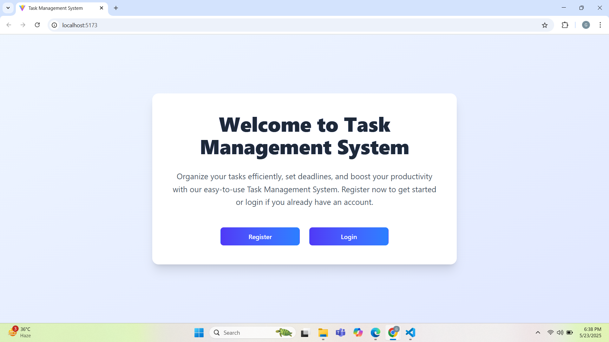
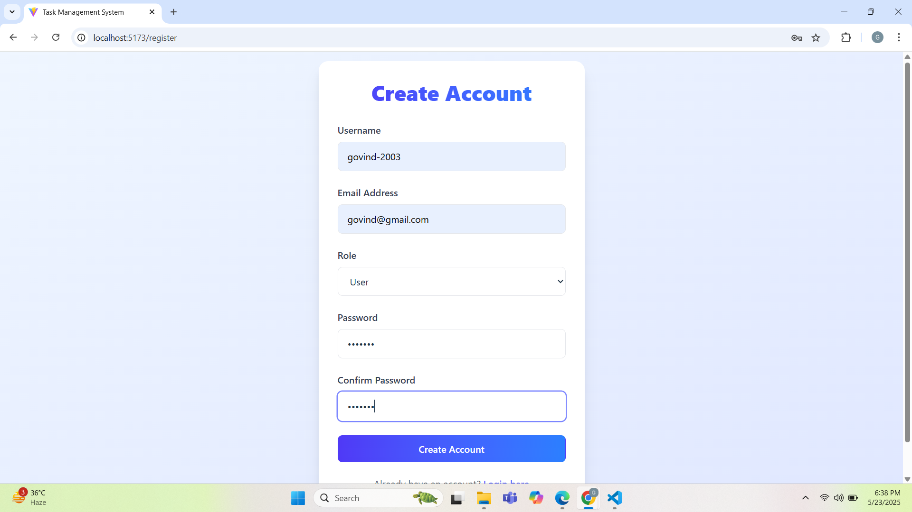
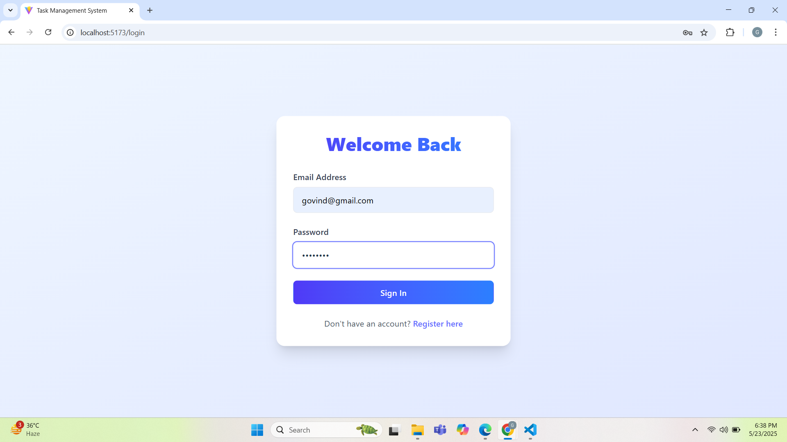
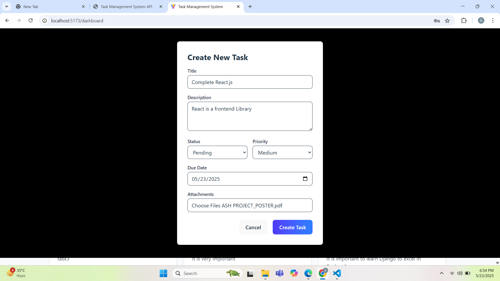
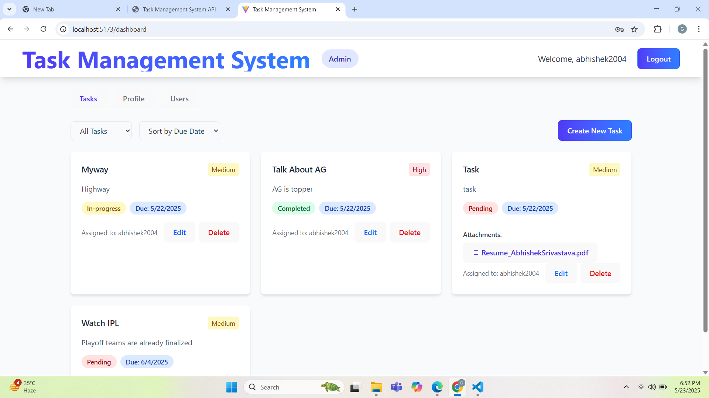
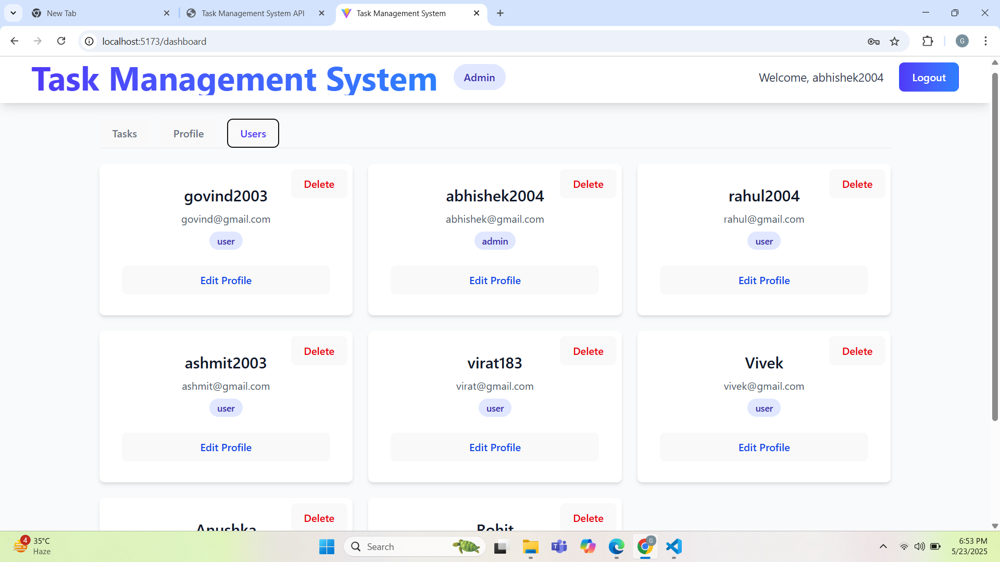
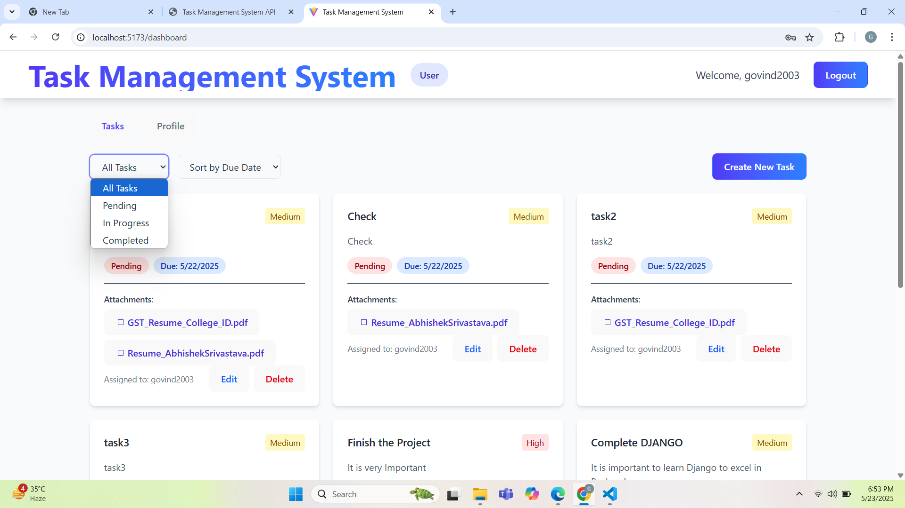
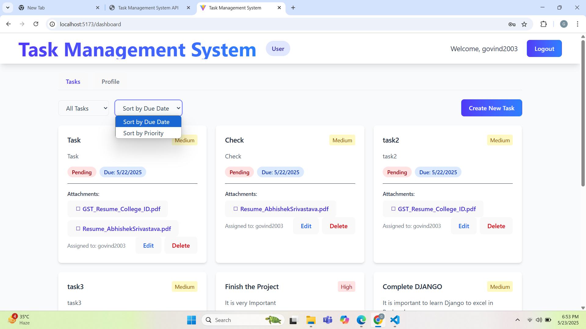

# Task Management System

A full-stack task management application built with MERN stack (MongoDB, Express.js, React, Node.js) that allows users to create, manage, and track tasks with file attachment capabilities.

## 🔗 Quick Links
- **Live Demo**: [Task Management System](https://task-manageer-frontend.vercel.app/)
- **API Documentation**: [Postman Docs](https://documenter.getpostman.com/view/33089753/2sB2qajhS7)

<div align="center">
  
</div>

## 🚀 Features

### 🔐 User Authentication
- Secure login and registration
- Role-based access (Admin/User)
- JWT token authentication

<p align="center">
  
  
</p>

### 📋 Task Management
- Create, read, update, and delete tasks
- Set priority levels (High, Medium, Low)
- Track task status (Pending, In-Progress, Completed)
- File attachments (PDF support, up to 3 files)
- Due date assignment

<div align="center">
  
</div>

### 👑 Admin Features
- User management
- Task assignment to different users
- View all tasks across users

<p align="center">
  
  
</p>

### 👤 User Features
- Personal task dashboard
- Task filtering and sorting
- PDF file attachments

<p align="center">
  
  
</p>

## 🛠️ Technology Stack

- **Frontend**: React.js, TailwindCSS
- **Backend**: Node.js, Express.js
- **Database**: MongoDB
- **File Storage**: Local storage
- **Authentication**: JWT
- **Containerization**: Docker

## ⚙️ Prerequisites

- Node.js (v14 or higher)
- MongoDB
- Docker (optional)
- Git

## 📦 Installation

### 🐳 Using Docker (Recommended)

1. Clone the repository:
```bash
git clone https://github.com/yourusername/task-management-system.git
cd task-management-system
```

2. Create `.env` file in root directory:
```properties
# Backend Configuration
PORT=5000
NODE_ENV=development
MONGODB_URI=your_mongodb_uri
JWT_SECRET=your_jwt_secret

# Frontend Configuration
VITE_API_URL=http://localhost:5000/api
VITE_BASE_URL=http://localhost:5000
VITE_TOKEN_KEY=task_management_token
```

3. Run with Docker Compose:
```bash
docker-compose up --build
```

Access the application at:
- Frontend: http://localhost:5173
- Backend: http://localhost:5000

### 🔧 Manual Installation

1. Clone and install dependencies:
```bash
git clone https://github.com/yourusername/task-management-system.git
cd task-management-system

# Install backend dependencies
cd backend
npm install

# Install frontend dependencies
cd ../client
npm install
```

2. Set up environment variables:
   - Copy `.env.example` to `.env` in both directories
   - Update the variables with your values

3. Start the application:
```bash
# Start backend (from backend directory)
npm run dev

# Start frontend (from client directory)
npm run dev
```

## 📁 Project Structure

```
task-management-system/
├── backend/                # Backend server code
│   ├── controllers/       # Request handlers
│   ├── middleware/        # Custom middleware
│   ├── models/           # Database models
│   ├── routes/           # API routes
│   └── uploads/          # File storage
├── client/                # Frontend React application
│   ├── src/
│   │   ├── components/   # React components
│   │   ├── services/     # API services
│   │   └── styles/       # CSS styles
│   └── public/           # Static files
├── Pictures/             # Project screenshots
└── docker-compose.yml    # Docker configuration
```

## 🔄 Contributing

1. Fork the repository
2. Create your feature branch (`git checkout -b feature/AmazingFeature`)
3. Commit your changes (`git commit -m 'Add some AmazingFeature'`)
4. Push to the branch (`git push origin feature/AmazingFeature`)
5. Open a Pull Request

## 📝 License

This project is licensed under the MIT License - see the [LICENSE](LICENSE) file for details.

